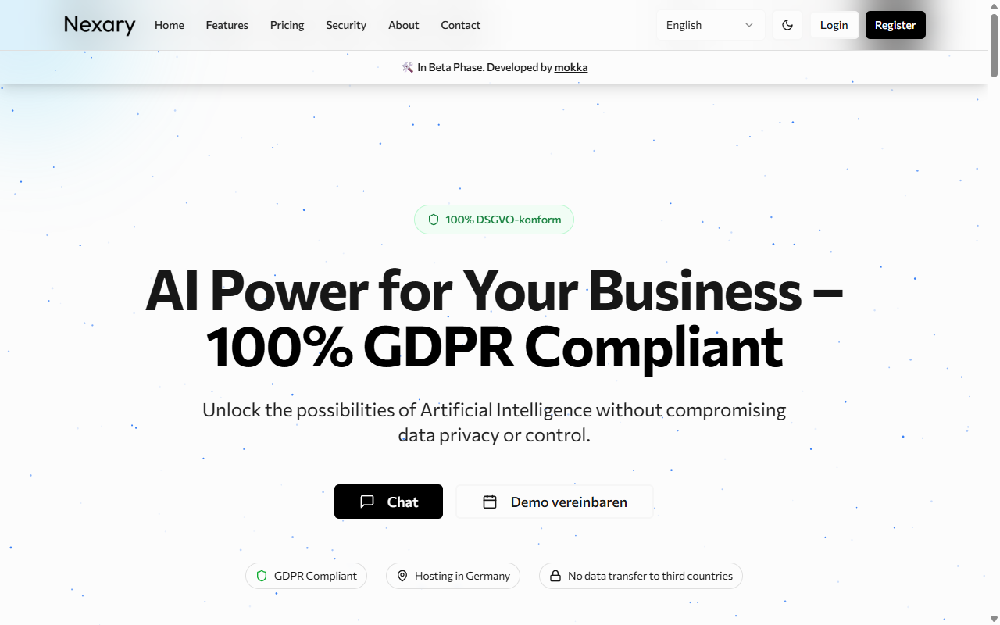
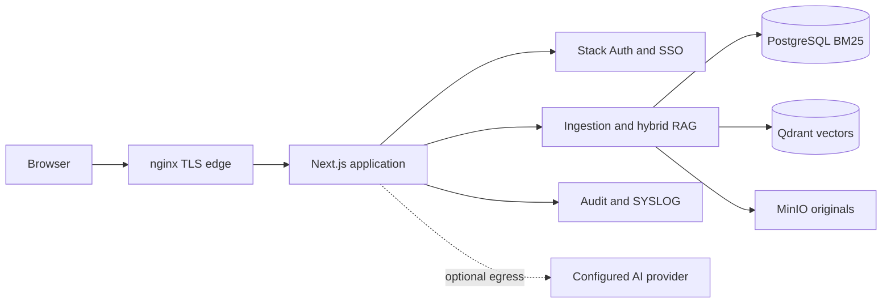
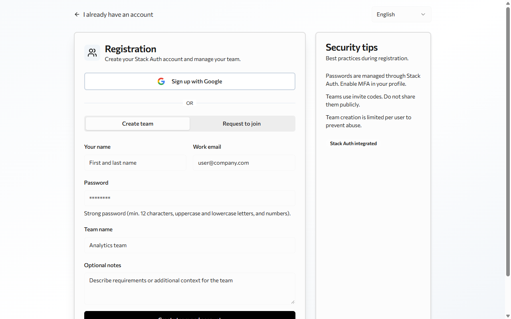

<h1 align="center">Nexary</h1>
<p align="center"><strong>Hybrid RAG and auditable AI collaboration for customer-controlled networks.</strong></p>
<p align="center">
  <a href="LICENSE"></a>
  
  
</p>
<p align="center"><a href="#quickstart">Quickstart</a> · <a href="#architecture">Architecture</a> · <a href="#screenshots">Screenshots</a> · <a href="docs/README.md">Documentation</a></p>



An on-premise AI platform export for multi-provider chat, document retrieval and auditable operations. Provider egress is optional configuration; the deployment keeps application data in customer-controlled infrastructure.

## Why this exists

Regulated teams need to inspect where data goes, retrieve exact identifiers as well as concepts, and export activity to existing operations tooling.

| Control | Retrieve | Operate |
| :--- | :--- | :--- |
| Customer-network deployment and SSO | Dense retrieval + BM25 + reranking | Audit events and SYSLOG export |
| Docker Compose, PostgreSQL and MinIO | Qdrant and PostgreSQL full text | Health endpoints and runbooks |

**Status:** public portfolio export. The production Linux deployment was previously verified; this export has not been re-verified as a fresh end-to-end private-cloud install. The OCR service is separate, and no customer data or credentials are included.

## Quickstart

The private-cloud stack requires Docker and the services in the [installation guide](docs/guides/INSTALLATION-GUIDE.md).

```bash
cp .env.example .env
docker compose -f docker-compose.private-cloud.yml up -d --build
```

On PowerShell, use `Copy-Item .env.example .env`. Configure values in `.env`; do not commit them.

| Variable group | Purpose |
| :--- | :--- |
| Provider, PostgreSQL, Qdrant, MinIO and Redis settings | Private-cloud service connections |
| Auth settings | Application identity configuration |

This is a deployment wiring guide, not a verified one-command laptop stack. UI-only work uses `bun install && bun run dev` with reachable PostgreSQL.

## Architecture



Retrieval fuses lexical and vector candidates before reranking; originals, metadata and vectors stay in separate stores. [Architecture and boundaries ->](docs/architecture.md)

## Screenshots

| Landing surface | Registration flow |
| :---: | :---: |
|  |  |

These captures show the exported UI, not a fresh deployment verification.

## Engineering decisions

| Decision | Benefit | Tradeoff |
| :--- | :--- | :--- |
| Qdrant + PostgreSQL BM25 | Exact identifiers and semantic matches both contribute | Two retrieval paths must be operated and evaluated |
| Provider abstraction | Deployments can choose allowed providers | Egress and provider behavior need per-deployment controls |
| Private-cloud topology | Customer controls data stores and network boundaries | More services than a hosted SaaS |
| SYSLOG audit export | Fits existing SIEM operations | Not an independent compliance audit |

## What I'd do differently

- **Build an evaluation set before retrieval features.** Exact-identifier failures established that dense-only retrieval was insufficient.
- **Enforce secret handling from the first build.** Configuration must remain environment-only and reviewable.
- **Separate demonstration material sooner.** Session summaries obscured operator documentation until this public export was reorganized.

[Documentation index](docs/README.md) · [Demo script](docs/demo.md) · [Compliance guides](docs/compliance/) · [Runbooks](docs/runbooks/)

---

Built by **Youssef Ouhaghi Ahmian** · [Mokka](https://mokka-agentur.de) · [GitHub](https://github.com/Gjusev)
Released under the [MIT license](LICENSE).
