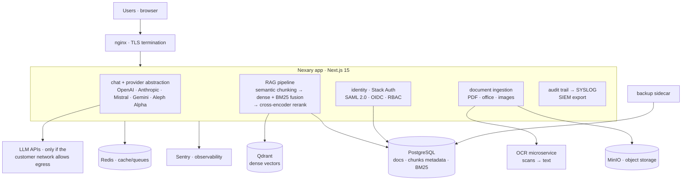

# Nexary — Enterprise AI Platform (on-premise)

**Multi-provider LLM platform with hybrid RAG that runs entirely inside a customer network: no external SaaS dependencies, every audit trail exportable via SYSLOG.** The deployment constraint — an air-gapped enterprise LAN with regulated data (German professional secrecy, STGB §203) — made every decision harder and every decision better.

[](LICENSE)


## Why this exists

Enterprise customers in regulated industries (legal, healthcare, finance) could not use any cloud AI assistant: data may not leave the network, and every action must be auditable. Nexary is the answer to "what does an AI collaboration platform look like when *nothing* can call out" — multi-provider inference behind one abstraction, retrieval that has to work without external APIs, and compliance (audit, SYSLOG export, SSO/SAML) as architecture, not as an afterthought.

> The constraint made every decision harder and every decision better.

## What's inside

- **Multi-provider chat** — OpenAI, Anthropic, Mistral, Google Gemini, Aleph Alpha behind one provider abstraction; per-conversation model choice; token + cost tracking per user and team.
- **Hybrid RAG** — smart semantic chunking, dense retrieval (Qdrant) fused with BM25, cross-encoder reranking; multi-format ingestion: PDF, OCR microservice for scans, images, office formats.
- **Enterprise identity** — Stack Auth with SAML 2.0, OIDC (Authentik/Keycloak), role-based permissions, organization scoping.
- **Compliance as architecture** — complete audit trails with SYSLOG export (SIEM-ready), STGB §203 compliance documentation, data residency entirely on-premise.
- **Multilingual** — UI and document handling in 6+ languages with automatic detection.
- **Operations** — Sentry, structured logging, health endpoints, docker-compose private-cloud topology, k8s manifests, backup sidecar.

## Architecture



Full decisions and trade-offs: [`docs/architecture.md`](docs/architecture.md). Deployment topology: [`docker-compose.private-cloud.yml`](docker-compose.private-cloud.yml), [`k8s/`](k8s/). Compliance: [`docs/compliance/stgb203-compliance.md`](docs/compliance/stgb203-compliance.md).

## Demo video

[`docs/demo.md`](docs/demo.md) is the 60-second recorded walkthrough (hosted deployment, real documents): multi-provider chat → hybrid RAG answer with citations → audit trail → SYSLOG export. <!-- TODO-VIDEO: record with OBS per docs/demo.md, embed here -->

## Run locally (partial — see note)

The full private-cloud stack:

```bash
cp .env.example .env        # fill provider keys + POSTGRES/QDRANT/MINIO/REDIS + AUTH
docker compose -f docker-compose.private-cloud.yml up -d --build
# app + postgres 15 + qdrant + redis + minio + nginx + backup sidecar
```

> **Honest status:** build and deployment verified on the production Linux host; this repository export has not been re-verified end-to-end locally (the OCR microservice is a separate deployment). UI-only development: `bun install && bun run dev` with a reachable Postgres.

## What I'd do differently

1. **Hybrid search from day one.** The first retrieval iteration was dense-only and failed on exact identifiers (contract numbers, statute references); BM25 + fusion fixed classes of queries that embeddings fundamentally miss. I'd never ship RAG without the lexical arm again.
2. **Secrets discipline earlier.** Early Docker build iterations hardcoded environment values — purged and rotated later, but the cost of getting this wrong in a regulated context is high enough that env-only should be enforced by CI from commit one.
3. **Fewer root-level process documents.** Roadmaps and implementation summaries accreted at the repo root; they belong in `docs/` (fixed in this export) or out of the repo entirely.

## Author

**Youssef Ouhaghi Ahmian** — [mokka-agentur.de](https://mokka-agentur.de) · [GitHub](https://github.com/Gjusev)

MIT License — see [LICENSE](LICENSE). Contributing: [CONTRIBUTING.md](CONTRIBUTING.md).
