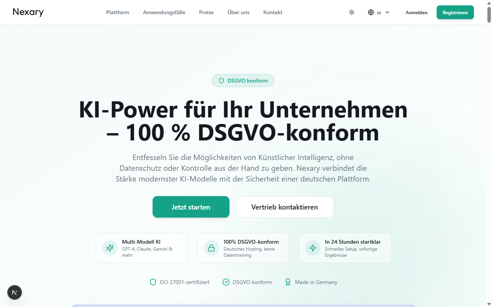
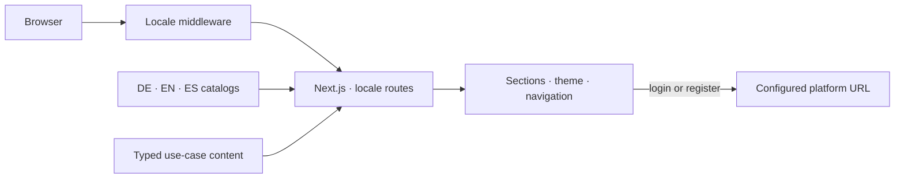
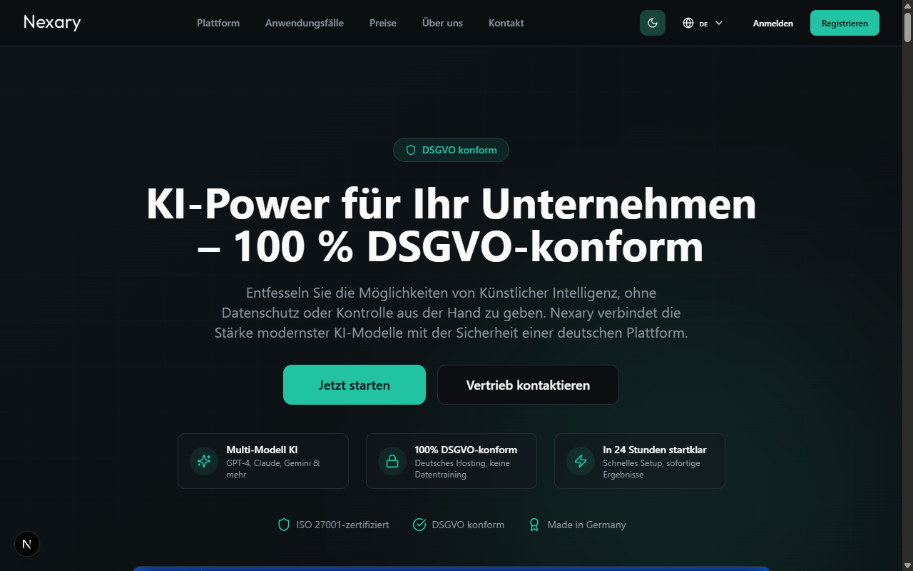
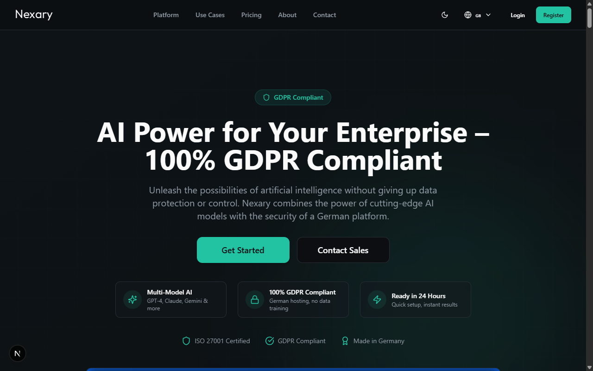
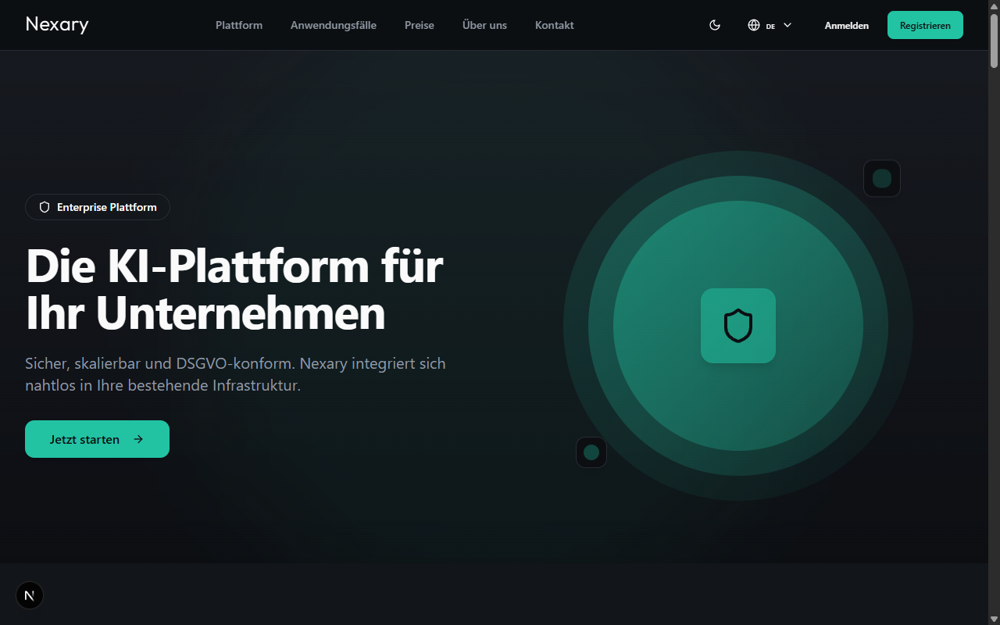
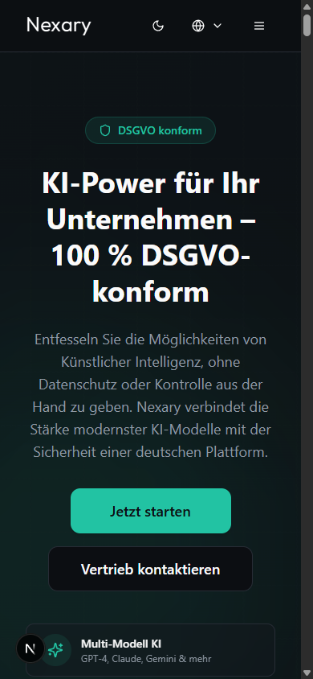

<h1 align="center">Nexary</h1>
<p align="center"><strong>One product story. Three languages.</strong></p>
<p align="center">
  <a href="LICENSE"></a>
  
  
  
</p>
<p align="center">
  <a href="#quickstart">Quickstart</a> · <a href="#architecture">Architecture</a> · <a href="#screenshots">Screenshots</a> · <a href="docs/README.md">Documentation</a>
</p>



The marketing frontend for an enterprise AI platform: localized product pages, use cases, light and dark themes, and a configurable handoff to the application. Built with Next.js App Router and `next-intl`.

## Why this exists

An enterprise platform needs a clear explanation before a technical buyer reaches the login screen. This site presents the same product in German, English and Spanish without maintaining three separate websites.

| Three locales | Two themes | One application URL |
| :--- | :--- | :--- |
| Locale-prefixed routes and message catalogs | System preference with a manual override | Login and registration links configured centrally |
| `next-intl` | `next-themes` and CSS variables | `NEXT_PUBLIC_APP_URL` |

**Scope:** marketing frontend, not the AI platform itself. The repository demonstrates implementation; product and compliance statements visible in the sample content are not independent certification evidence.

## Quickstart

Requires Node.js 20+ and npm.

```bash
# from the nexary-platform repository root:
cd marketing
npm ci
npm run dev
```

Open [localhost:3000/de](http://localhost:3000/de), [/en](http://localhost:3000/en) or [/es](http://localhost:3000/es).

To connect the CTAs to your platform, create `.env.local`:

```dotenv
NEXT_PUBLIC_APP_URL=https://app.example.com
```

The default is a placeholder URL. This public configuration is bundled into the frontend at build time. [Setup and checks →](docs/getting-started.md)

## Architecture



The current deployment uses **`next build` + `next start`**, including locale middleware and configured response headers. A plain static export is not configured. [Rendering, configuration and tradeoffs →](docs/architecture.md)

## Screenshots

| Dark theme | English locale |
| :---: | :---: |
|  |  |

<details>
<summary><strong>Platform page and mobile layout</strong></summary>

| Platform overview | Mobile |
| :---: | :---: |
|  |  |

</details>

## Engineering decisions

| Decision | Benefit | Tradeoff |
| :--- | :--- | :--- |
| Message catalogs per locale | Shared components and explicit translations | Changes need review in three languages |
| Typed use-case data | Reusable detail templates | Content structure must remain consistent |
| Centralized application URLs | One setting for deployment-specific CTAs | Changing public configuration requires rebuilding |
| Next.js middleware and headers | Locale negotiation and response policy in one deployment | A Node-compatible runtime is still needed |

Accessibility features include keyboard navigation, focus styles and labeled controls. A full WCAG conformance audit is not claimed.

## What I'd do differently

- **Centralize environment-specific URLs from the first commit.** It avoids hunting through pages when moving between deployments.
- **Keep design research outside the application tree.** Reference material should not become shipped assets.
- **Add automated locale and keyboard-flow checks early.** Visual review alone does not catch every missing translation or focus regression.

[Documentation index](docs/README.md) · [Architecture](docs/architecture.md) · [Setup and deployment](docs/getting-started.md)

---

Built by **Youssef Ouhaghi Ahmian** · [Mokka](https://mokka-agentur.de) · [GitHub](https://github.com/Gjusev)  
Released under the [MIT license](LICENSE).
