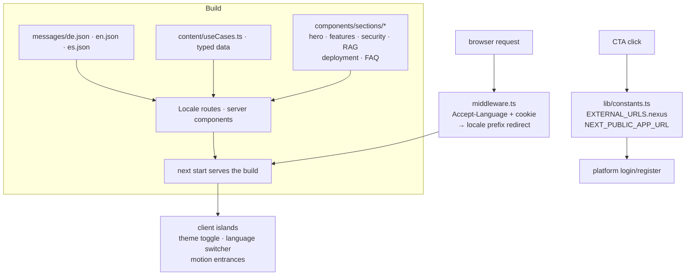

# Architecture

[← Documentation](README.md) · [Getting started](getting-started.md)

A Next.js 15 marketing site served with `next build` + `next start`: the
middleware negotiates locale, routes render from message catalogs, and the
only dynamic behavior is the theme toggle and the handoff to the platform
deployment. A plain static export is not configured.

## Rendering pipeline

## Decisions

| Decision | Why |
|---|---|
| **next-intl with locale-prefixed routes** | SEO per market (`/de`, `/en`, `/es`) and one catalog per locale; German default because it is the primary buying market. |
| **`next build` + `next start` (RSC)** | One Node deployment serves locale middleware and response headers; the product itself lives elsewhere behind customer auth. |
| **Single constants module for external URLs** | Login/register hand off to the platform deployment; `NEXT_PUBLIC_APP_URL` swaps environments without touching components. |
| **shadcn/ui + Tailwind + CSS variables** | Consistent accessible primitives; theme switching is variable swaps, not a second stylesheet. |
| **Security headers in next.config** | CSP (app origin env-driven), HSTS preload, X-Frame-Options DENY, nosniff — the site is the first thing a security reviewer of the platform sees. |
| **framer-motion for entrances only** | Perceived polish without blocking LCP; respects reduced-motion. |

## i18n mechanics

- `middleware.ts` negotiates the locale (`Accept-Language` + persisted
  cookie) and redirects bare paths to the prefixed route.
- Server components read catalogs directly; client islands receive
  translations through `next-intl`'s provider.
- Use-case pages are a typed data model (`content/useCases.ts`) rendered
  through one detail template — adding a use case touches data, not markup.

## Quality gates

`npm run lint` (Next.js 15 with `.eslintrc.json`) · `npm run typecheck` (tsc --noEmit) ·
`npm run build` (must produce the production build).
